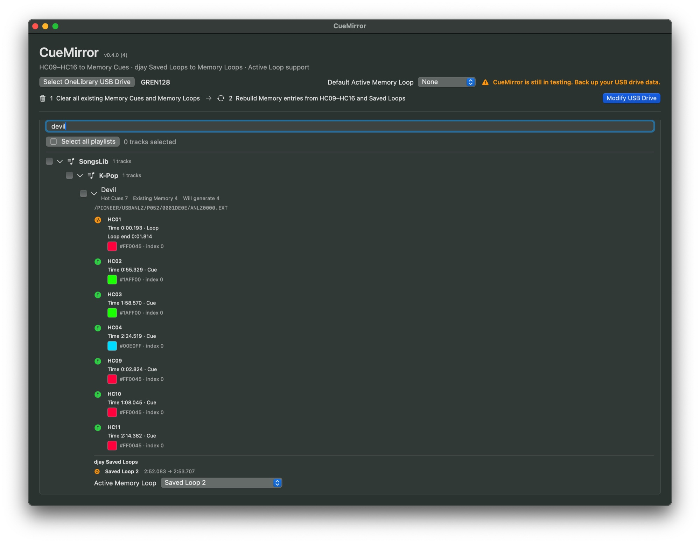
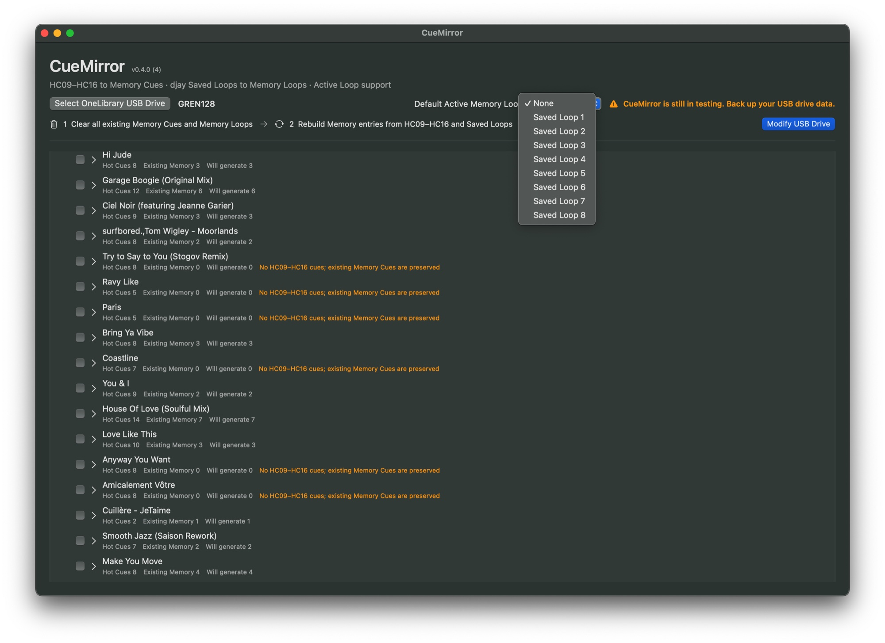

# CueMirror

CueMirror is an experimental macOS utility that converts djay Pro Hot Cues 9–16 into Memory Cues and djay Saved Loops into Memory Loops on a OneLibrary USB drive. It can also mark a selected Saved Loop as an Active Loop for compatible CDJ/XDJ hardware.

> CueMirror is still in testing. Back up your USB drive data before using it.

## What CueMirror does

CueMirror bridges metadata that djay Pro stores on a OneLibrary USB drive with the Memory Cue and Memory Loop features available on compatible Pioneer DJ/AlphaTheta players. It works directly with the exported USB structure, lets you choose individual tracks or playlists, previews the source cues and loops, and verifies every file after writing.

- Keeps Hot Cue slots 1–8 unchanged.
- Copies Hot Cue slots 9–16 into the track's new Memory set.
- Converts djay Saved Loop slots 1–8 into Memory Loops.
- Maps Hot Cue and Saved Loop colors to the closest supported CDJ Memory Cue color; Saved Loops without stored color use blue.
- Selects an Active Memory Loop by the original djay Saved Loop slot, even when loop times are in a different chronological order.
- Supports a global Active Loop default plus a per-track override or `None`.
- Clears and rebuilds existing Memory Cues and Memory Loops only on selected, processable tracks.
- Handles FLAC, MP3, WAV, and AIFF automatically.
- Shows scan and conversion progress so long operations remain visibly distinguishable from a stalled app.

## CueMirror 0.5.0

Version 0.5.0 preserves Hot Cue 09–16 colors when creating Memory Cues and uses any recognizable Saved Loop color metadata when creating Memory Loops. Colors are mapped to the closest option in the eight-color Rekordbox/CDJ Memory Cue palette; Saved Loops without color metadata default to blue. The previously hardware-tested Memory Loop and Active Memory Loop behavior is unchanged.

## CueMirror 0.4.0

Version 0.4.0 adds the complete Saved Loop workflow: independent Saved Loop detection, Memory Loop generation, and Active Loop selection. It also introduces per-track overrides, debounced track search that preserves matching playlist paths, background conversion with live progress, and a complete English interface.

## Latest interface

Search waits briefly until typing stops, then shows only matching tracks and the playlist hierarchy that contains them. Expanding a track reveals its Hot Cues, Saved Loops, and per-track Active Memory Loop setting.



The global Active Memory Loop menu can select `None` or any Saved Loop slot from 1 through 8. Tracks can follow this global choice or override it individually.



## Real-world hardware validation

This photo was taken during a venue test after CueMirror rewrote the OneLibrary metadata. The CDJ loaded the USB drive and displayed the generated Memory Cue markers on the waveform alongside the original Hot Cues.


## Current support

- macOS 15.2 or later on Apple silicon
- OneLibrary USB drives exported by djay Pro
- Automatic FLAC, WAV, AIFF, and MP3 handling—no format selection required
- Point cues and loops in Hot Cue slots 9–16, copied as Memory entries
- djay Saved Loop slots 1–8, converted to Memory Loops without changing slot identity
- Global and per-track Active Memory Loop selection
- Batch selection by playlist or track
- Debounced track search with matching playlist paths

CueMirror preserves Hot Cues, but replaces all existing Memory Cues and Memory Loops on each selected track with the newly generated Memory set.

## Using CueMirror

1. Install [Homebrew](https://brew.sh) if needed, then install Python 3.14:

   ```sh
   brew install python@3.14
   ```

2. Back up the USB drive.
3. Open CueMirror and select the root of the OneLibrary drive.
4. Review the scan results and select tracks or playlists.
5. Confirm the replacement operation.
6. Safely eject the drive and verify it on compatible hardware before relying on it for a performance.

If Python 3.14 is missing, CueMirror displays the same installation command in the app. Python is used only for the read-only SQLCipher database query; CueMirror works on a temporary copy and does not connect directly to the database on the USB drive.

Audio format handling is automatic. FLAC keeps its dedicated verified locator, WAV and AIFF use macOS packet metadata, and MP3 frames are parsed once per track and reused for all its cues. Audio locating happens only when selected tracks are prepared for writing, so normal USB scanning is not slowed down by format detection.

## Building

Open `CueMirror.xcodeproj` in Xcode 16.2 or later and build the `CueMirror` scheme. The current database reader also requires Homebrew Python 3.14, normally installed at `/opt/homebrew/bin/python3.14`.

For a local Release archive:

```sh
./scripts/build-release.sh
```

The archive is written to `dist/`. GitHub Actions also builds the same artifact when a tag matching `v*` is pushed. Release artifacts are ad-hoc signed, but are not notarized by Apple.

## Versioning

The user-facing version comes from Xcode's `MARKETING_VERSION`; the build number comes from `CURRENT_PROJECT_VERSION`. CueMirror displays both directly from its app bundle. For a new release, update both values, commit the change, and create a matching tag such as `v0.1.0`.

## Tests

The parser and conversion planner have self-contained unit tests. Hardware and FLAC integration tests are skipped when their local fixtures are unavailable.

## Disclaimer

This project is unofficial and is not affiliated with or endorsed by Algoriddim, AlphaTheta, Pioneer DJ, or rekordbox. It modifies files on removable media and is provided without warranty. Use it only on data you can restore.

## License

MIT. See [LICENSE](LICENSE).

## Support the project

If CueMirror is useful to you, please consider starring this repository.

A GitHub Star helps other OneLibrary and DJ users discover the project,
and it lets me know that continued development and compatibility work
are worthwhile.

Click **Star** at the top-right of this page.
